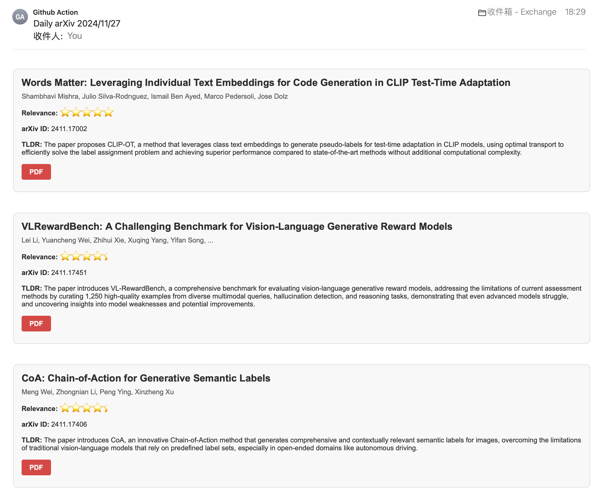
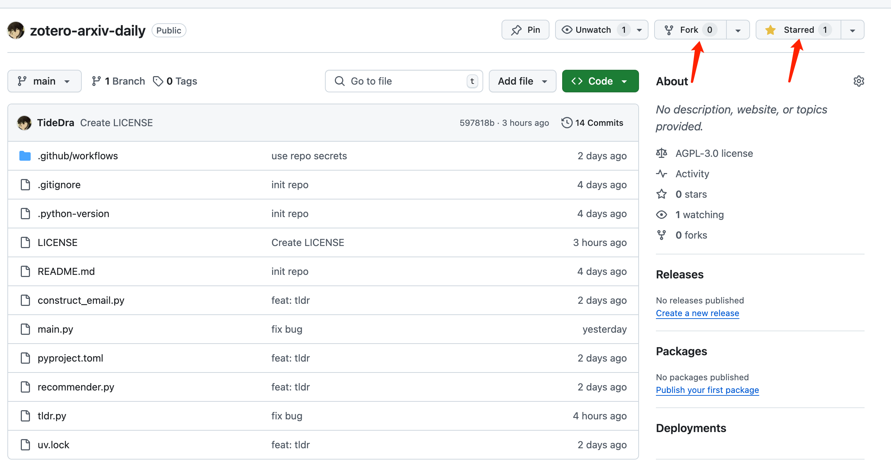
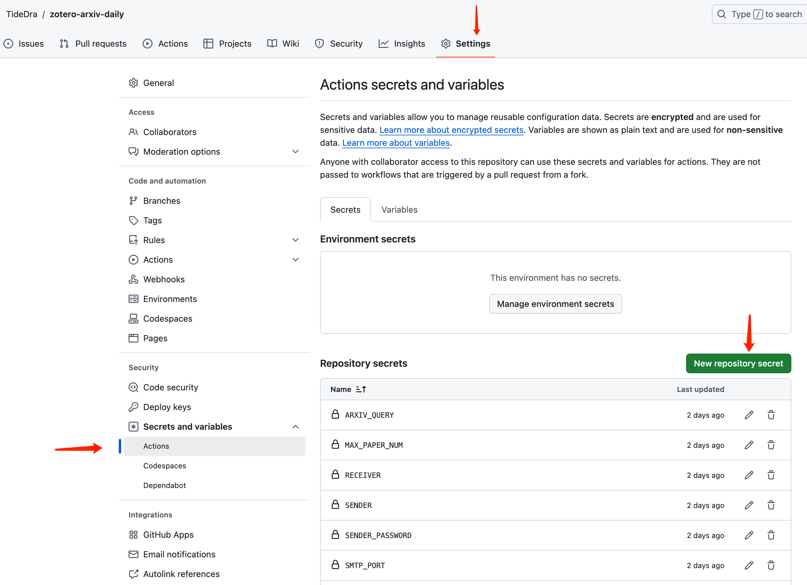
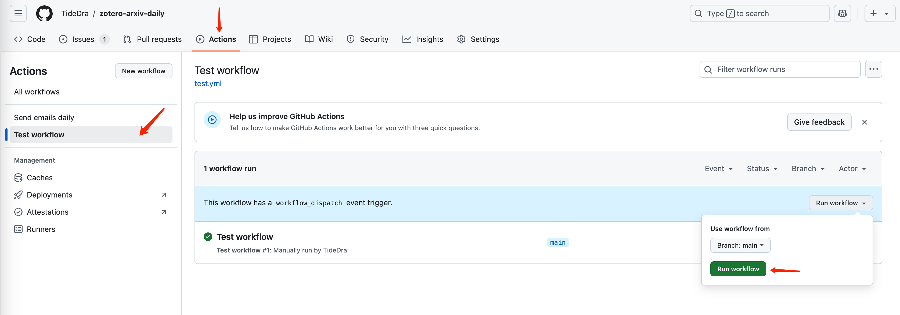

<p align="center">
  <a href="" rel="noopener">
 </a>
</p>

<h3 align="center">Zotero-arXiv-Daily</h3>

<div align="center">

  []()
  
  [](https://github.com/TideDra/zotero-arxiv-daily/issues)
  [](https://github.com/TideDra/zotero-arxiv-daily/pulls)
  [](/LICENSE)

</div>

---

<p align="center"> Recommend new arxiv papers of your interest daily according to your Zotero libarary.
    <br> 
</p>

> [!IMPORTANT]
> Please keep an eye on this repo, and merge your forked repo in time when there is any update of this upstream, in order to enjoy new features and fix found bugs.

## 🧐 About <a name = "about"></a>

> Track new scientific researches of your interest by just forking (and staring) this repo!😊

*Zotero-arXiv-Daily* finds arxiv papers that may attract you based on the context of your Zotero libarary, and then sends the result to your mailbox📮. It can be deployed as Github Action Workflow with **zero cost**, **no installation**, and **few configuration** of Github Action environment variables for daily **automatic** delivery.

## ✨ Features
- Totally free! All the calculation can be done in the Github Action runner locally within its quota (for public repo).
- AI-generated TL;DR for you to quickly pick up target papers.
- Links of PDF and code implementation (if any) presented in the e-mail.
- List of papers sorted by relevance with your recent research interest.
- Fast deployment via fork this repo and set environment variables in the Github Action Page.

## 📷 Screenshot


## 🚀 Usage
### Quick Start
1. Fork (and star😘) this repo.


2. Set Github Action environment variables (repository secrets).


Here are all the variables you need to set:

| Key | Type | Description | Example |
| :--- | :---  | :---  | :--- |
| ZOTERO_ID |  str  | User ID of your Zotero account. Get your ID from [here](https://www.zotero.org/settings/security). | 12345678  |
| ZOTERO_KEY |  str  | An Zotero API key with read access. Get a key from [here](https://www.zotero.org/settings/security).  | AB5tZ877P2j7Sm2Mragq041H   |
| ARXIV_QUERY | str  | The search query for retrieving arxiv papers. Refer to the [official document](https://info.arxiv.org/help/api/user-manual.html#query_details) for details. The example queries papers about AI, CV, NLP, ML. Find the abbr of your research area from [here](https://arxiv.org/category_taxonomy).  | cat:cs.AI OR cat:cs.CV OR cat:cs.LG OR cat:cs.CL |
| SMTP_SERVER | str | The SMTP server that sends the email. I recommend to utilize a seldom-used email for this. Ask your email provider (Gmail, QQ, Outlook, ...) for its SMTP server| smtp.qq.com |
| SMTP_PORT | int | The port of SMTP server. | 25 **QQ should use port 465. An error occurs for the port 587**|
| SENDER | str | The email account of the SMTP server that sends you email. | abc@qq.com |
| SENDER_PASSWORD | str | The password of the sender account. Note that it's not necessarily the password for logging in the e-mail client, but the authentication code for SMTP service. Ask your email provider for this.   | abcdefghijklmn |
| RECEIVER | str | The e-mail address that receives the paper list. | abc@outlook.com |
| MAX_PAPER_NUM | int | The maximum number of the papers presented in the email. This value directly affects the execution time of this workflow, because it takes about 70s to generate TL;DR for one paper. `-1` means to present all the papers retrieved. | 50 |

That's all! Now you can test the workflow by manually triggering it:


> [!NOTE]
> The Test-Workflow Action is the debug version of the main workflow (Send-emails-daily), which always retrieve 5 arxiv papers regardless of the date. While the main workflow will be automatically triggered everyday and retrieve new papers released yesterday. There is no new arxiv paper at weekends and holiday, in which case you may see "No new papers found" in the log of main workflow.

Then check the log and the receiver email after it finishes.

By default, the main workflow runs on 22:00 UTC everyday. You can change this time by editting the workflow config `.github/workflows/main.yml`.

### Local Running
Supported by [uv](https://github.com/astral-sh/uv), this workflow can easily run on your local device if uv is installed:
```bash
# set all the environment variables
# export ZOTERO_ID=xxxx
# ...
cd zotero-arxiv-daily
uv run main.py
```
> [!IMPORTANT]
> The workflow will download and run an LLM (Qwen2.5-3B, the file size of which is about 3G). Make sure your network and hardware can handle it.

> [!WARNING]
> Other package managers like pip or conda are not tested. You can still use them to install this workflow because there is a `pyproject.toml`, while potential problems exist.

## 📖 How it works
*Zotero-arXiv-Daily* firstly retrieves all the papers in your Zotero libarary and all the papers released in the previous day, via corresponding API. Then it calculates the embedding of each paper's abstract via an embedding model. The score of a paper is its weighted average similarity over all your Zotero papers (newer paper added to the libarary has higher weight).

The TLDR of each paper is generated by a lightweight LLM (Qwen2.5-3b-instruct-q4_k_m), given its title, abstract, introduction, and conclusion (if any). The introduction and conclusion are extracted from the source latex file of the paper.

## 📌 Limitations
- The recommendation algorithm is very simple, it may not accurately reflect your interest. Welcome better ideas for improving the algorithm!
- This workflow deploys an LLM on the cpu of Github Action runner, and it takes about 70s to generate a TLDR for one paper. High `MAX_PAPER_NUM` can lead the execution time exceed the limitation of Github Action runner (6h per execution for public repo, and 2000 mins per month for private repo). Commonly, the quota given to public repo is definitely enough for individual use. If you have special requirements, you can deploy the workflow in your own server, or use a self-hosted Github Action runner, or pay for the exceeded execution time.

## 📃 License
Distributed under the AGPLv3 License. See `LICENSE` for detail.

## ❤️ Acknowledgement
- [pyzotero](https://github.com/urschrei/pyzotero)
- [arxiv](https://github.com/lukasschwab/arxiv.py)
- [sentence_transformers](https://github.com/UKPLab/sentence-transformers)
- [llama-cpp-python](https://github.com/abetlen/llama-cpp-python)

## 🌟 Star History

[](https://star-history.com/#TideDra/zotero-arxiv-daily&Date)
